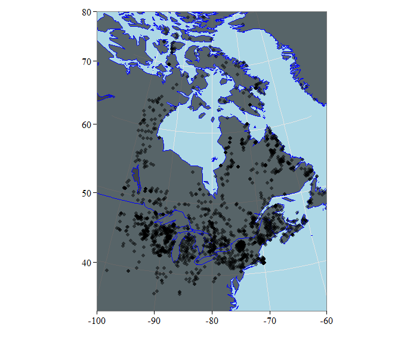
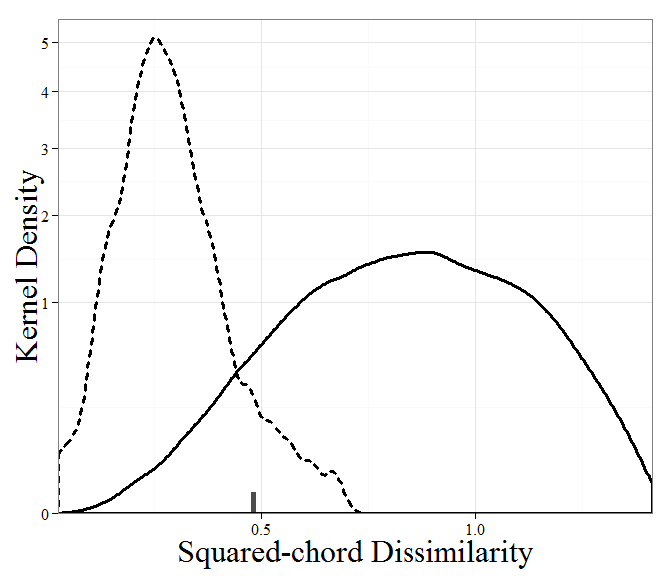
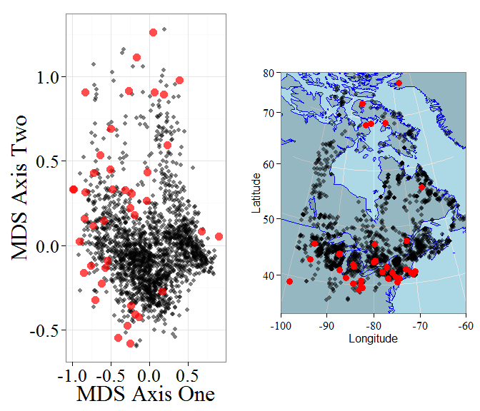
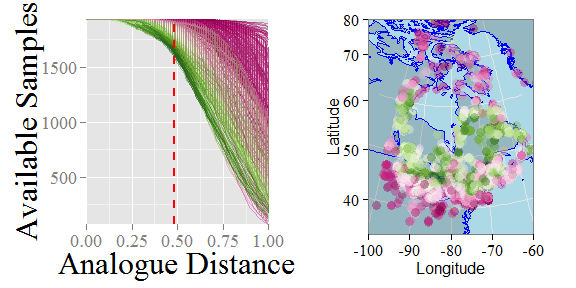
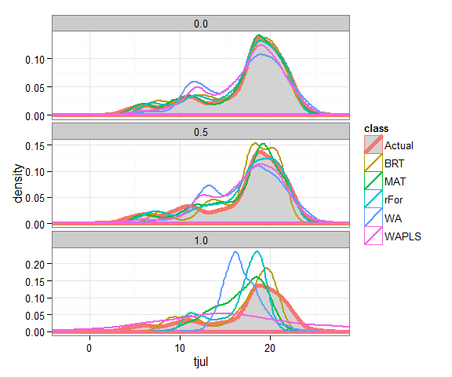
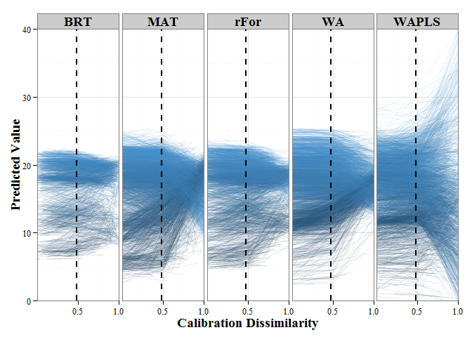
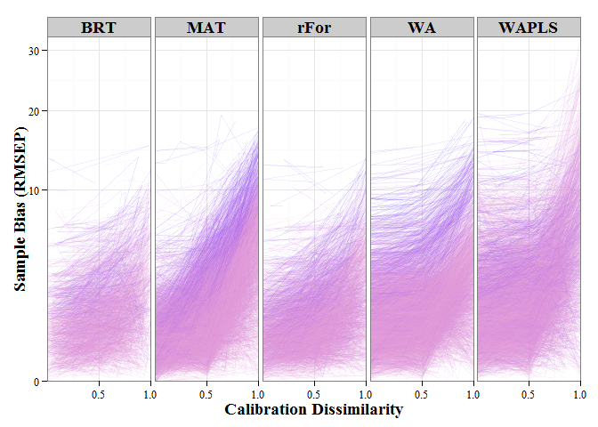
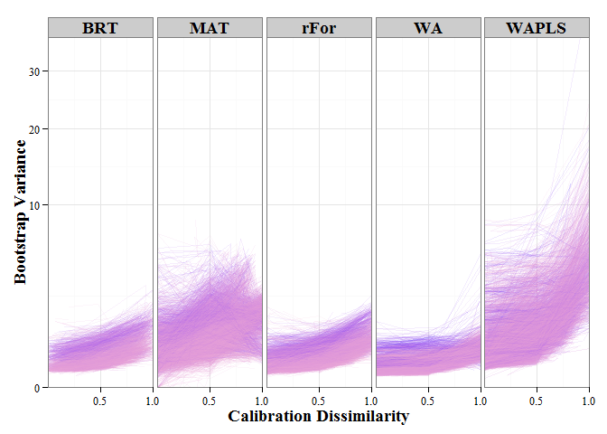

---
author: 'Simon Goring *et al*.'
biblio-files: 'non-analogue_clim'
bibliography: 'non-analogue_clim.bib'
csl: 'elsevier-harvard.csl'
date: '23 July, 2015'
output:
  md_document:
    variant: markdown
  pdf_document:
    pandoc_args: '-V geometry:vmargin=1in -V geometry:hmargin=1in'
title: |
    Non-analogues in paleoecological reconstruction - the effects of
    analogue distance
...

Non-analogues in paleoecological reconstruction - the effects of analogue distance
==================================================================================

<!--

-->
Simon Goring^1^

J Sakari Salonen^2^

Miska Luoto^2,3^

Jack Williams^1,4^

^1^ Department of Geography, University of Wisconsin-Madison, Madison,
WI, USA

^2^ ?????????

^3^

^4^ Center for Climatic Research, University of Wisconsin-Madison,
Madison, WI, USA

**Abstract** *Fossil pollen provides a widespread proxy for past
vegetation. It is increasingly used in paleoclimatic reconstruction, but
the limits of its utility are not well known. Methodological advances,
such as the development of tests for spatial autocorrelation, and newer
methods for climate reconstruction using boosted regression trees may
improve the abilities of these climate reconstruction techniques, but
little is known about the accuracy of these models under conditions of
non-analogue vegetation known to occur at the end of the late glacial.
In this paper we generate non-analogue pollen assemblages by excluding
close neighbours from calibration datasets at increasingly larger
squared chord distances. Using three standard and two newer techniques
we then test the ability of pollen-based climate models to accurately
recostruct climate under conditions of no-analogue vegetation.*

Introduction
============

Pollen assemblages are widely used for paleoclimatic reconstruction
during the Holocene, but this method is also applied to pollen
assemblages from the last Glacial period [@bartlein2011pollen,
@kaufman2012multi], and earlier
[@tarasov2011progress; @brewer2008climate, @cheddadi1998climate]. A
particular challenge for climate reconstruction using these much earlier
samples is the presence of non-analogue vegetation. Non-analogue pollen
assemblages pose a problem for many reconstruction techniques, these
vegetation assemblages may be the result of sets of climate variables
that no longer co-exist, ecological conditions resulting from differing
rates of species migration (REF) or release from herbivores
[@gill2009pleistocene], or as a result of changes in human land use
[@goring2015preset].

Predicting climate from pollen in non-analogue space is likely to
increase the uncertainty of models, possibly introduce systematic bias
in predictions, and is likely to increase the variability of predictions
across a time-series of predictions from a single site. However,
high-quality terrestrial proxies for climate are important for
understanding past climate change, and can act as a constraint on models
of climate change in the past derived from GCMs in regions where little
proxy data is available. Thus, understanding the behaviour of
pollen-based climate reconstructions in non-analogue space is an
important first stem in understanding these reconstructions.

Although we cannot know the values for temperature or precipitation
during this time, statistical non-analogues do exist in a modern
context, and we can construct false non-analogues using a modified
h-block sampling procedure [*sensu*, @telford2009evaluation] that
examines analogue distance rather than geographical distance.

Methods:
========

Sites from across North America were used to build a modern analogue
dataset. Samples were obtained from the North American Modern Pollen
Database east of 100^o^W. Pollen taxa were standardized as in Gill et
al. [@gill2015noanalogues], using a set of 54 taxa, similar to those
reported in Whitmore et al. [-@whitmore2005modern]. We chose to exclude
Western North America since pollen taxa such as *Tsuga canadensis* and
*Tsuga heterophylla* may be morphologically indistinct, but their parent
plant taxa have clearly differentiated distributions, thus it may be
possible to find false close-analogues using the entire North American
dataset. While this is not, strictly speaking, a major problem for this
analysis, it will raise baseline error rates for models which then cause
us to underestimate the change in error as analogue distance is
increased.

**Figure 1**. *Location of sample plots used for analysis. Samples are
derived from a modern pollen dataset.*

To analyse the effects of non-analogue pollen on model skill we chose
five pollen-based reconstruction methods from the literature and apply
them to the modern pollen data from eastern North America. The models
are MAT, WA, WAPLS, BRT and randomForest. Each of these models has been
used previously in the pollen literature, and has strengths and
weaknesses. MAT [@overpeck1985quantitative] is commonly applied to
reconstruct climate, for pollen, diatoms, chironomids and other taxa. WA
has a long history in the literature, and the recent development of
monotone deshrinking has apparently improved performance further
(Simpson, 2014?), but WA continues to suffer from a basic assumption of
unimodal taxon distributions along climate gradients.

WAPLS does this and that. . .

SAKARI or MISKA can you add text here about BRT?

Results
=======

When we examine the dissimilarity scores we can see that the
distribution between minimum, maximum and overall dissimilarities can be
understood numerically and spatially.

Mean minimum dissimilarity for pollen samples in the modern pollen
dataset ranges from 0.0257127 to 0.0257127, with a 95% confidence
interval from 0.1143664 to 0.4711897. The highest minimum analogue
distance is for an unpublished site along the New York, Pennsylvannia
border. The site is notable for very high proportions of *Fraxinus
pennsylvanica/americana* pollen, more than 5x higher than the next
closest site. The lowest minimum distance occurs across four sites, two
from Thinn Lake, identified as potentially anomalous in Williams et al
[-@williams2009rapid] and XXXX. The geographic distribution of
non-analogue sites is particularly interesting since many of the sites
are in close proximity to other modern sites. This indicates that While
spatial autocorreltaion is likely to play a role in the proximity of
analogues (and thus their predictions) [@telford2009evaluation] it is
not always the case that spatially proximate samples are compositionally
proximate, and indeed, pollen assemblages in densely sampled regions may
exhibit no-analogue characteristics.

**Figure 2**. *Distribution of squared-chord dissimilarity values. The
95% confidence interval for the minumum spanning distance in the North
American Modern Pollen Database is 0.10 - 0.48. We choose 0.48 (marked
on the x axis) as our cut-off for 'non-analogue' distances in the
database.*

**Figure 3**. *Location of non-analogue points in the modern pollen
data, presented within a non-metric multidimensional scaling ordination
(Panel 1) and geographically. Interestingly, although a number of
geographically isolated points exist in the dataset, the majority of
non-analogue points exist within the most dense region of sampling,
indicating that non-analogue sites are not ecologically stratified.*

Climate Variables
=================

We used the 1937 records from the North American Modern Pollen Database
and associated climate data to provide reconstructions of key climatic
variables. The process of calculating the lambda/lambda ratio from RDA
(ref) produces interesting relationships, perhaps impacted by the
breadth of the available climate and pollen data across North America.

  Variable   Percent Variability
  ---------- ---------------------
  sjun       23
  sjul       22
  sjja       22
  smay       21
  saug       21
  ssep       20
  smam       20

Key variables based on the $\frac{\lambda_1}{\lambda_2}$ using pCCA
appear to be climate variables relating to mean monthly percent summer
sunshine (variables preceded by an 's'). These variables are likely to
be variables that are combinations of temperature and preciptiation
variables, however this value is not linear, nor is it continuous,
meaning that . While Telford & Birks (2009) have criticised sunshine
reconstructions (Freshette et al., 2008) in the past (and perhaps with
good reason), the strength of the sunshine signal in the climate data is
worth noting, but the limitations of CCA may impact our ability to
detect and accurately assess its importance.

Model outputs
=============

Once the climate variables of interest were established we began by
bootstrapping the models for these climate variables. From the total
pool of samples we generate a calibration dataset by sampling with
replacement.

**Figure 4**. *As the analogue distance exclusion is increased the
available data set size is reduced, although some points continue to
maintain a large number of potential analogues, this is directly related
to the minimum distance to the closest analogue. Points that maintain a
large pool of analogues are far from neighbours.*

We have an interesting distribution of loss here. First, the color
coding is based on loss to 'non-analogue' conditions, and we see that it
is possible for some samples to have relatively low loss to the
no-analogue point, but then much higher losses to the extreme end of our
analogue space (see the magenta lines at the very bottom end of Figure
4a.). Secondly, the points that lose the most samples tend to be in the
boreal forest. To some degree this is surprising, however, the dominance
of Pinus and Picea in these forests likely means that they have smaller
analogue distances from one another than samples in the southern forests
(with more diversity and therfore, likely fewer close analogues), but
also, surpisingly, arctic samples also have higer inter-sample
distances, and are thus less sensitive to losses of close analogues.
 **Figure 5**. *Climate predictions for
July temperature using the full data set at an analogue distance of 0,
0.5 and 1. These results indicate that most predictive methods capture
the full environmental gradient, however WA and WAPLS appear to
over-emphasise the middle of the environmental gradient, BRT appears to
truncate the gradient at both high and low ends. As expected, MAT
appears to capture the true gradient best when the full data set is
used, but rapidly regresses to the mean as distance to the nearest
neighbor increases.*

**Figure 5**. *Change in site predictions over time. Of great interest
is the difference between model outputs as the exclusion zone increases.
MAT can never predict beyond the extent of the data samples in the pool,
and so as the exclusion zone increases the predictions move toward the
dataset mean. WAPLS uses an initial transformation and then regresses
against it to predict new values, so as the exclusion zone increases we
see an increase in the spread of the predicted values, with much greater
variability and a loss of accuracy.*

**Figure 6**. *Change in model bias with increasing analogue distance.*

**Figure 7**. *Change in bootstrap variance with increasing analogue
distance.*

Discussion
==========

What does this tell us about predicting climate in non-analogue space?

Key points:\
Most predictive methods are stable until the no-analogue threshold is
met. Beyond this threshold the collapse of most methods is
(surprisingly) rapid, in part due to the fact that the number of samples
available for the calibration function drops substantially, indicating
high sensitivity to the sample neighborhood for each of these methods.

-   WAPLS can't be trusted given its bizarre behaviour beyond analogue
    space.

-   MAT is incredibly dependent on finding close neighbors. As analogue
    distance increases to near neighbours the likelihood of having poor
    fit increases substantially. This is manifested in the apparent
    'flip' in predictions. We don't get regression to the mean, we get
    regression to the nearest available sample.
-   BRT seems most robust, but for the purposes of this simulation (in
    lage part) it is mind-bogglingly slow, even when compared to
    rForest, howver (1) for a single run this is unlikely to be an issue
    (single runs can take somewhere between 1 and 10 minutes) and (2)
    interstingly BRT predictions are the most constrained, i.e., the
    predictive output has a much narrower range of predictions than the
    underlying data set.

References
==========

Bartlein, P. J., Harrison, S. P., Brewer, S., Connor, S., Davis, B. A.
S., Gajewski, K., ... & Wu, H. (2011). Pollen-based continental climate
reconstructions at 6 and 21 ka: a global synthesis. Climate Dynamics,
37(3-4), 775-802.

Brewer, S., Guiot, J., Sánchez-Goñi, M. F., & Klotz, S. (2008). The
climate in Europe during the Eemian: a multi-method approach using
pollen data. Quaternary Science Reviews, 27(25), 2303-2315.
