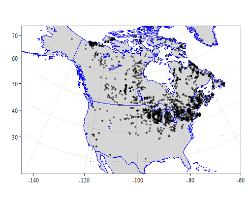
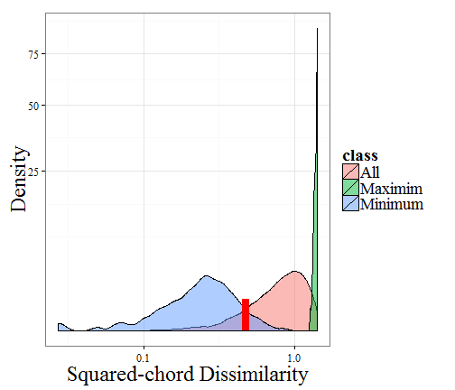
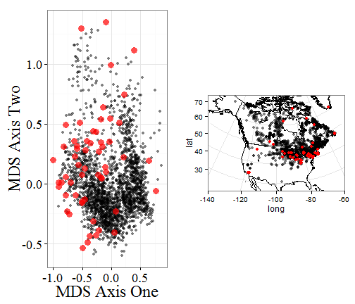
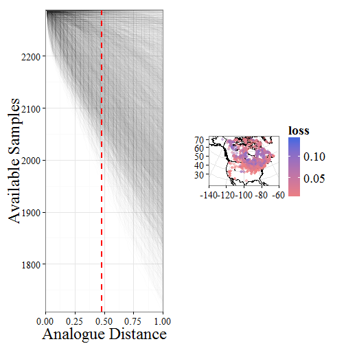
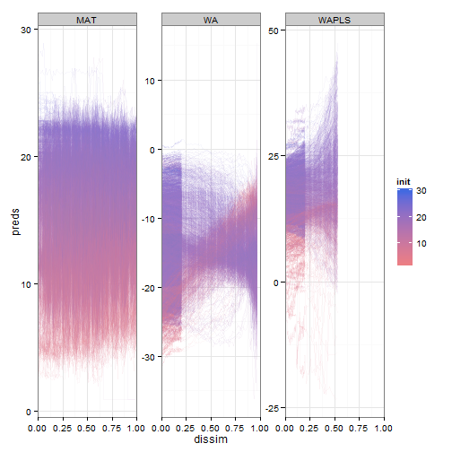

Non-analogues in paleoecological reconstruction - the effects of analogue distance
========================================================

**Abstract**
Some jibberish.


Introduction
=========================
Pollen assemblages are widely used for paleoclimatic reconstruction during the Holocene, but this method is also applied to pollen assemblages from the last Glacial period (Bartlein et al., 2011), as well as to earlier pollen assemblages, such as those during the Eemian (Brewer et al, 2008).  A particular challenge for climate reconstruction using these much earlier samples is the presence of non-analogue vegetation.  Non-analogue pollen assemblages pose a problem for many reconstruction techniques, these vegetation assemblages may be the result of sets of climate variables that no longer co-exist, ecological conditions resulting from differing rates of species migration or release from herbivores (Gill et al., 2009?), or as a result of changes in human land use (St. Jacques?, maybe not the best. . .).  

Predicting climate from pollen in non-analogue space is likely to increase the uncertainty of models, possibly introduce systematic bias in predictions, and is likely to increase the variability of predictions across a time-series of predictions from a single site. However, high-quality terrestrial proxies for climate are important for understanding past climate change, and can act as a constraint on models of climate change in the past derived from GCMs in regions where little proxy data is available.  Thus, understanding the behaviour of pollen-based climate reconstructions in non-analogue space is an important first stem in understanding these reconstructions.

Although we cannot know the values for temperature or precipitation during this time, statistical non-analogues do exist in a modern context, and we can construct false non-analogues using a modified h-block sampling procedure (e.g., Telford & Birks) that examines analogue distance rather than geographical distance.

Methods:
=========================

Sites from across North America were used to build a modern analogue dataset.

 

**Figure 1**. Location of sample plots used for analysis.  Samples are derived from a modern pollen dataset.


Results
=========================

When we examine the dissimilarity scores we can see that the distribution between minimum, maximum and overall dissimilarities can be understood numerically and spatially.

 

**Figure 2**.  *Distribution of squared-chord dissimilarity values.  The 95% confidence interval for the minumum spanning distance in the North American Modern Pollen Database is 0.10 - 0.48.  We choose 0.48 as our cut-off for 'non-analogue' distances in the database.*

 

**Figure 3**. *Location of non-analogue points in the modern pollen data, presented within a non-metric multidimensional scaling ordination (Panel 1) and geographically.  Interestingly, although a number of geographically isolated points exist in the dataset, the majority of non-analogue points exist within the most dense region of sampling, indicating that non-analogue sites are not ecologically stratified.*

Climate Variables
=========================

We used the 2289 records from the North American Modern Pollen Database and associated climate data to provide reconstructions of key climatic variables. The process of calculating the lambda/lambda ratio from RDA (ref) produces interesting relationships, perhaps impacted by the breadth of the available climate and pollen data across North America.


```r

# Sakari, can you take a look at this and let me know what you think?  Am I
# doing this right, and what do you make of these results?  Are we simply
# using too large a dataset?

pol <- mod_pol[, 7:ncol(mod_pol)]
clim <- climate[, 4:ncol(climate)]

clim.ratio <- rep(NA, ncol(clim))

for (i in 1:ncol(clim)) {
    test.struct <- rda(pol ~ clim[, i])
    clim.ratio[i] <- test.struct$CCA$tot.chi/test.struct$CA$tot.chi
}

names(clim.ratio) <- colnames(clim)
best.clim <- round(clim.ratio[order(clim.ratio, decreasing = TRUE)] * 100, 0)
```


Variable | Percent Variability
-------- | -------------------
sjul | 19
sjja | 18
sjun | 18
saug | 17
smay | 17
gdd5 | 17
ssep | 16

Key variables based on the $latex \frac {\lambda_1} {\lambda_2} $ using pCCA appear to be climate variables relating to mean monthly percent summer sunshine (variables preceded by an 's').  These variables are likely to be variables that are combinations of temperature and preciptiation variables, however this value is not linear, nor is it continuous, meaning that .  While Telford & Birks (2009) have criticised sunshine reconstructions (Freshette et al., 2008) in the past (and perhaps with good reason), the strength of the sunshine signal in the climate data is worth noting, but the limitations of CCA may impact our ability to detect and accurately assess its importance.

Model outputs
=========================

Once the climate variables of interest were established we began by bootstrapping the models for these climate variables.  From the total pool of samples we generate a calibration dataset by sampling with replacement.  

 

**Figure X**. *As the analogue distance exclusion is increased the available data set size is reduced, although some points continue to maintain a large number of potential analogues, this is directly related to the minimum distance to the closest analogue.  Points that maintain a large pool of analogues are far from neighbours.*

 

**Figure X**. *Change in site predictions over time.  Of great interest is the difference between model outputs as the exclusion zone increases.  MAT can never predict beyond the extent of the data samples in the pool, and so as the exclusion zone increases the predictions move toward the dataset mean.  WAPLS uses an initial transformation and then regresses against it to predict new values, so as the exclusion zone increases we see an increase in the spread of the predicted values, with much greater variability and a loss of accuracy.*

Discussion
=========================
What does this tell us about predicting climate in non-analogue space?

References
=========================
Bartlein, P. J., Harrison, S. P., Brewer, S., Connor, S., Davis, B. A. S., Gajewski, K., ... & Wu, H. (2011). Pollen-based continental climate reconstructions at 6 and 21 ka: a global synthesis. Climate Dynamics, 37(3-4), 775-802.
Brewer, S., Guiot, J., Sánchez-Goñi, M. F., & Klotz, S. (2008). The climate in Europe during the Eemian: a multi-method approach using pollen data. Quaternary Science Reviews, 27(25), 2303-2315.
